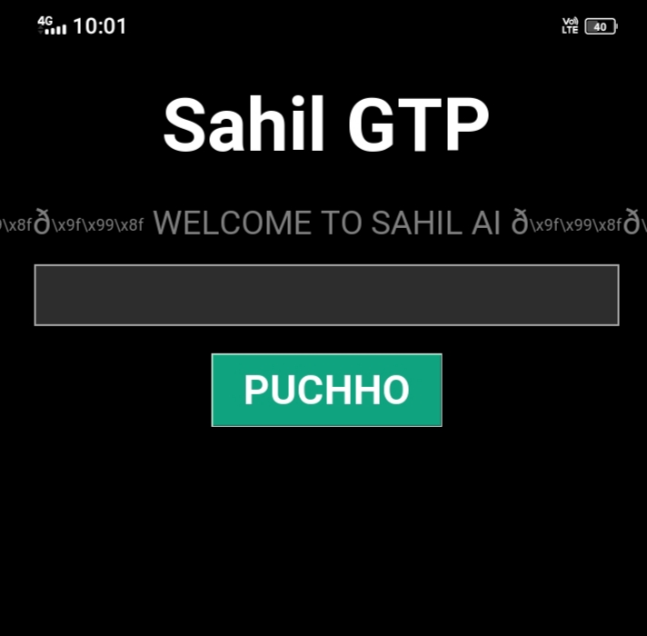

# 🤖 Sahil GTP - Python Chatbot App

## 📌 About Project
Sahil GTP is my first Python project - a simple desktop chatbot application with a clean GUI. 
Built using Python and Tkinter to learn basic programming, GUI development, and GitHub.

## ✨ Features
- Simple and clean chat interface with "PUCHHO" button
- Custom welcome screen with logo  
- Built with pure Python + Tkinter - no external libraries needed
- Lightweight and easy to run

## 🛠️ Tech Stack
- **Language:** Python 3
- **GUI:** Tkinter
- **Tools:** GitHub, VS Code

## 🚀 How to Run
1. Download `Sahil gtp.py` file
2. Make sure Python is installed
3. Double-click the file or run `python "Sahil gtp.py"`

## 🎯 What I Learned
- Python basics and functions
- Creating GUI applications with Tkinter  
- Using GitHub for project hosting
- Writing documentation and README

## 🙏 Acknowledgments
Built as my first coding project. Learned by taking help from documentation, tutorials & AI tools to understand concepts and implement them myself.

---
**Made with ❤️ by Sahil | My Coding Journey Starts Here** 🚀
